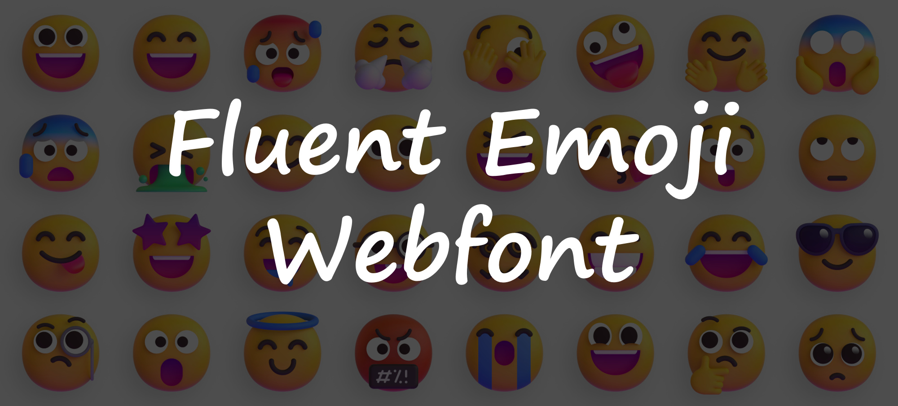
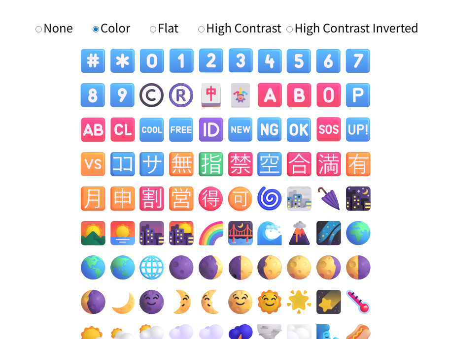

# Fluent Emoji Webfont🤗

Version 0.8.0  
  
You can confirm from [Listing emoji sample](https://tetunori.github.io/fluent-emoji-webfont/sample/list/) or [p5.js sample](https://tetunori.github.io/fluent-emoji-webfont/sample/p5.js_usage).

# Description🖊️

This repository supplies Webfont version of [`Fluent Emoji`](https://github.com/microsoft/fluentui-emoji) from Microsoft.  
By using this, You can use `Fluent Emoji` anywhere/anytime with any device(even with a non-Windows device)!  
Here you can choose one of three types of `Fluent Emoji`.

- `Fluent Emoji Color`
  - 
- `Fluent Emoji Flat`
  - 
- `Fluent Emoji High Contrast`
  - 

# Samples

- [p5.js demo](https://tetunori.github.io/fluent-emoji-webfont/sample/p5.js_usage)
- [Listing emoji](https://tetunori.github.io/fluent-emoji-webfont/sample/list)
  - 

# How to use🪄

## General usage

Add `@import url('***.css')` and `font-family` in your `.css` file as below:

```css
@import url('https://tetunori.github.io/fluent-emoji-webfont/dist/FluentEmojiColor.css');

html, body {
  ...
  font-family: 'Fluent Emoji Color';
  ...
}
```

Here are the other options for `font-family`:

```css
@import url('https://tetunori.github.io/fluent-emoji-webfont/dist/FluentEmojiFlat.css');
...
  font-family: 'Fluent Emoji Flat';
```

```css
@import url('https://tetunori.github.io/fluent-emoji-webfont/dist/FluentEmojiHighContrast.css');
...
  font-family: 'Fluent Emoji High Contrast';
```

## p5.js usage

After `@import url('***.css')` in `.css` file as in the section '[General usage](#general-usage)', call `textFont()` as below:

```javascript
function setup() {
  createCanvas(windowWidth, windowHeight);
  textFont('Fluent Emoji Color');
}

function draw() {
  background(0);
  text('🐲🥳🎉👏🎊🍻', width / 2, height / 2);
}
```

**Note: The font might take a time to load, so if it does not work, try reloading it in your browser.**

## Environment

Currently, this fonts have a lot of bugs and restrictions. Please refer to the following table and [GitHub Issues](https://github.com/tetunori/fluent-emoji-webfont/issues) for the latest status.  
I am also super welcoming your confirmation. Please feel free to comment for your confirmation result in the issue thread: [(#17)Confirmation results in each environment](https://github.com/tetunori/fluent-emoji-webfont/issues/17).

| Environment | [Listing sample](https://tetunori.github.io/fluent-emoji-webfont/sample/list) | [p5.js sample](https://tetunori.github.io/fluent-emoji-webfont/sample/p5.js_usage) | Ref: [Noto Color Emoji](https://fonts.google.com/noto/specimen/Noto+Color+Emoji) | Note |
| --- | --- | --- | --- | --- |
| 💻Windows 11, Chrome | ✅ | ✅ | ✅ | Windows 11 Home `v10.0.26100`, Chrome `v131.0.6778.205`|
| 💻Windows 11, Edge | ✅ | ✅ | ✅ | Windows 11 Home `v10.0.26100`, Edge `v131.0.2903.112`|
| 💻macOS , Chrome | ✅ | ✅ | ✅ | M2 Mac `Sonoma v14.7.1`, Chrome `v131.0.6778.205`|
| 💻macOS , Safari | ❌ | 🤔 | ❌ | M2 Mac `Sonoma v14.7.1`, Safari `v17.6(19618.3.11.11.5)`. Listing: lots of emojis are not shown or need many time to render. p5.js: Basically good but some characters are not displayed. correctly. |
| 📱iOS , Chrome | ❌ | 🤔 | ❌ | iOS `18.1.1`, Chrome `v131.0.6778.154`. Listing: lots of emojis are not shown. p5.js: Basically good but some characters are not displayed.|
| 📱iOS , Safari | ❌ | 🤔 | ❌ | iOS `18.1.1`. Listing: lots of emojis are not shown. p5.js: Basically good but some characters are not displayed.|
| 📱Android , Chrome | ❔ | ❔ | ❔ | Not tested yet.|
| 💻ChromeOS , Chrome| ❔ | ❔ | ❔ | Not tested yet.|


# Maintenance

## Environment

Here is my dev environment

- OS: Windows 11 Home `v10.0.26100`
- Browser: Google Chrome `v131.0.6778.205`
- Python: `v3.11.9`

## Build

Execute `build.sh` with an `fontType` option.

```shell
./build.sh color
```

- Options: `color`, `flat` and `hc` for `High Contrast`

Then, you can get `FluentEmoji***NNN.woff2` files and a `FluentEmoji***.css` file after long (about half an hour) time build.

## Test/Confirm

### Listing emojis

Check the result with the [Listing emoji](https://tetunori.github.io/fluent-emoji-webfont/sample/list) sample.  
You can also update the JS list file `sample/list/glyphs.js` with the command below:

```
python makelist.py
```

# License⚖️

Copyright (c) 2024 [Tetsunori Nakayama](https://github.com/tetunori). MIT License.

# Author🧙‍♂️

Tetsunori Nakayama

# References📚

## fluentui-emoji

All of SVG font assets and other images. (Huge thanks and 💕 to Microsoft !!)  
[fluentui-emoji](https://github.com/microsoft/fluentui-emoji) by [microsoft](https://github.com/microsoft). MIT License.

## fluent-color-emoji

Conversion scripts.  
[fluent-color-emoji](https://github.com/GCMarvin/fluent-color-emoji) by [GCMarvin](https://github.com/GCMarvin). The Unlicense.

## p5.js

For a sample code
[p5.js](https://github.com/processing/p5.js) by [Processing Foundation](https://github.com/processing). GNU Lesser General Public License v2.1.
